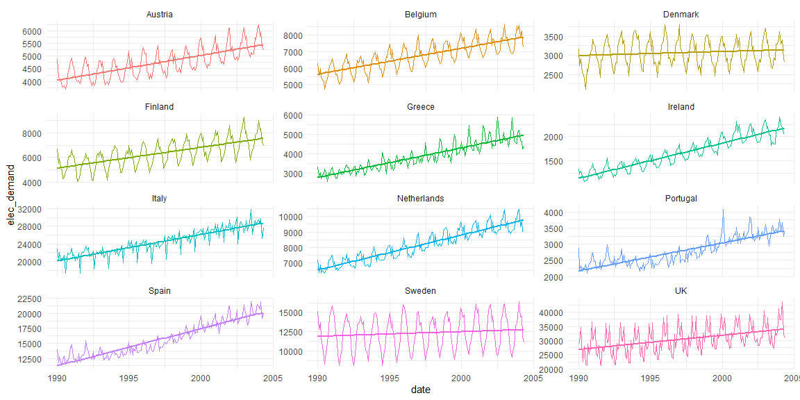

Scalable Demand Forecasting and Safety Stock Modelling using Forecast
Error
================
Maciej Lecicki
24.10.2021

<br/> <br/> <br/>

### Purpose and objectives

<br/>

The purpose of this project is to illustrate how to develop robust
demand forecasting model based on time series analysis and machine
learning in R environment. <br/>

Important goal of this project is to show: <br/> - potential of open
source software like R for demand forecasting,<br/> - scalability of
this approach, namely ease of forecasting automation for multiple
products/regions,<br/> - ability to shape model selection criteria using
common and customized metrics,<br/> - focus on forecast error and
confidence intervals as input to scenario planning for supply planning
or S&OP process,<br/> - use of forecast error as ‘demand uncertainty’
part of Safety Stock calculation.

##### Libraries and data

<br/>

``` r
library('tidyverse')
library('tidymodels')
library('modeltime')
library('timetk')
library('lubridate')
library('workflowsets')
library('tune')
library('patchwork')
```

Key libraries used in this project are modeltime and tidymodels, both
based on ‘tidyverse’ principles.

``` r
data <- read_csv('data/elecsupply.csv')
glimpse(data)
```

    ## Rows: 173
    ## Columns: 13
    ## $ date        <chr> "01.01.1990", "01.02.1990", "01.03.1990", "01.04.1990~
    ## $ Belgium     <dbl> 6287, 5546, 5975, 5461, 5272, 5171, 4735, 5132, 5293,~
    ## $ Denmark     <dbl> 3166, 2737, 2906, 2550, 2532, 2398, 2116, 2635, 2587,~
    ## $ Greece      <dbl> 3313, 2837, 3017, 2714, 2909, 2940, 3215, 3040, 2577,~
    ## $ Spain       <dbl> 13986, 11785, 12767, 11805, 11693, 12254, 12900, 1150~
    ## $ Ireland     <dbl> 1326, 1225, 1292, 1189, 1162, 1077, 1084, 1098, 1150,~
    ## $ Italy       <dbl> 22833, 20379, 22035, 20113, 20820, 20504, 21495, 1726~
    ## $ Netherlands <dbl> 7182, 6372, 6886, 6319, 6521, 6372, 6322, 6586, 6589,~
    ## $ Austria     <dbl> 4860, 4157, 4130, 4044, 3823, 3766, 3818, 3696, 3917,~
    ## $ Portugal    <dbl> 2867, 2214, 2338, 2157, 2273, 2208, 2387, 2090, 2235,~
    ## $ Finland     <dbl> 6688, 5536, 5927, 5176, 4969, 4262, 4355, 4820, 5064,~
    ## $ Sweden      <dbl> 15112, 12774, 13682, 11767, 10687, 9246, 8309, 9779, ~
    ## $ UK          <dbl> 29036, 29184, 34522, 24910, 22648, 27986, 21600, 2136~

``` r
range(data$date)
```

    ## [1] "01.01.1990" "01.12.2003"

Dataset consist of monthly demand for electrical supply for 12 European
countries collected between 1990 and 2003.

Let’s change table format from wide to long and visualize demand.

``` r
(elecsupply <- data %>%
  gather(country, elec_demand, Belgium:UK) %>%
  mutate(date = as_date(date, format = '%d.%m.%Y')) %>%
  relocate(country)
)
```

    ## # A tibble: 2,076 x 3
    ##    country date       elec_demand
    ##    <chr>   <date>           <dbl>
    ##  1 Belgium 1990-01-01        6287
    ##  2 Belgium 1990-02-01        5546
    ##  3 Belgium 1990-03-01        5975
    ##  4 Belgium 1990-04-01        5461
    ##  5 Belgium 1990-05-01        5272
    ##  6 Belgium 1990-06-01        5171
    ##  7 Belgium 1990-07-01        4735
    ##  8 Belgium 1990-08-01        5132
    ##  9 Belgium 1990-09-01        5293
    ## 10 Belgium 1990-10-01        5869
    ## # ... with 2,066 more rows

For demand visalization we could use plot_time_series() function (code
is included as comments) from timetk package. It provides interactive
element and has other advantages too, however I prefer ‘good old’ gglot2
which I find more elegant alternative if interaction isn’t necessary.

``` r
# elecsupply %>%
#   group_by(country) %>%
#   plot_time_series(date, elec_demand, .facet_ncol = 4, .smooth = FALSE)

elecsupply %>%
  ggplot(aes(x = date, y = elec_demand, group = country, color = country)) +
      geom_line(show.legend = FALSE) +
      theme_minimal() +
  facet_wrap(. ~ country, ncol = 3, scales = 'free_y') +
  geom_smooth(method = 'lm', se = FALSE, show.legend = FALSE)
```

<!-- -->

With quick glance at all plots we can tell that demand is seasonal and
there’s upward trend in demand for electrical supply.

##### Time series modelling

<br/>

The goal we’d like to achieve is development of best fit demand forecast
using available resources in R. The challenge is that we’d like to
automate this process and do it at scale, meaning that we’d like to
develop best models for all countries. <br/>

To do that, we’ll use modeltime package supported by tidymodels and
tidyverse. Let’s start by describing high level the process and list key
steps.<br/>

1.  Dataset will be split into train and test:<br/>

-   train will be used to build the model,<br/>
-   testset of 24 months will be used to validate acccuracy and select
    best model,<br/>
-   in addition, test will be used to evaluate expected error that can
    be cascaded to Safety Stock calculation and scenario planning,<br/>

2.  We’ll also expand dataset by 12 months to forecast demand for
    electrical supply; it will be done by refitting best model on full
    dataset (train + test),<br/>
3.  We’ll explore ‘classic’ time series approach and machine learning
    based model to develop demand forecasting model which minimizes
    selected forecast error metric,<br/>
4.  We’ll look into standard error metrics available in R libraries and
    enrich metrics selection through development of own, custom
    metrics.<br/>

Findings at each step of the process will be visualized using ggplot2.
This can also be used as input to Shiny web app (if required to be
shared with user that doesn’t have access to R environment).

##### Train, test and future datasets

<br/>

``` r
nested_data_tbl <- elecsupply %>%
  group_by(country) %>%
  extend_timeseries(
    .id_var = country,
    .date_var = date,
    .length_future = 12 # this will be our forecasting horizon (in months)
  ) %>%
  nest_timeseries(
    .id_var = country,
    .length_future = 12
  ) %>%
  split_nested_timeseries(
    .length_test = 24 # test dataset (periods are months)
  )

nested_data_tbl
```

    ## # A tibble: 12 x 4
    ##    country     .actual_data       .future_data      .splits         
    ##    <chr>       <list>             <list>            <list>          
    ##  1 Belgium     <tibble [173 x 2]> <tibble [12 x 2]> <split [149|24]>
    ##  2 Denmark     <tibble [173 x 2]> <tibble [12 x 2]> <split [149|24]>
    ##  3 Greece      <tibble [173 x 2]> <tibble [12 x 2]> <split [149|24]>
    ##  4 Spain       <tibble [173 x 2]> <tibble [12 x 2]> <split [149|24]>
    ##  5 Ireland     <tibble [173 x 2]> <tibble [12 x 2]> <split [149|24]>
    ##  6 Italy       <tibble [173 x 2]> <tibble [12 x 2]> <split [149|24]>
    ##  7 Netherlands <tibble [173 x 2]> <tibble [12 x 2]> <split [149|24]>
    ##  8 Austria     <tibble [173 x 2]> <tibble [12 x 2]> <split [149|24]>
    ##  9 Portugal    <tibble [173 x 2]> <tibble [12 x 2]> <split [149|24]>
    ## 10 Finland     <tibble [173 x 2]> <tibble [12 x 2]> <split [149|24]>
    ## 11 Sweden      <tibble [173 x 2]> <tibble [12 x 2]> <split [149|24]>
    ## 12 UK          <tibble [173 x 2]> <tibble [12 x 2]> <split [149|24]>

Actual and future data is nested inside newly created object and grouped
by country. In addition we have information about split for train and
test sets.<br/>

To get inside nested data we can use unnest() function from tidyr
library. Example is shown below. I encourage to also run commented code
to see the difference in output.

``` r
nested_data_tbl %>%
  filter(country == 'Denmark') %>%
  unnest(.actual_data) %>%
  select(country:elec_demand)
```

    ## # A tibble: 173 x 3
    ##    country date       elec_demand
    ##    <chr>   <date>           <dbl>
    ##  1 Denmark 1990-01-01        3166
    ##  2 Denmark 1990-02-01        2737
    ##  3 Denmark 1990-03-01        2906
    ##  4 Denmark 1990-04-01        2550
    ##  5 Denmark 1990-05-01        2532
    ##  6 Denmark 1990-06-01        2398
    ##  7 Denmark 1990-07-01        2116
    ##  8 Denmark 1990-08-01        2635
    ##  9 Denmark 1990-09-01        2587
    ## 10 Denmark 1990-10-01        2850
    ## # ... with 163 more rows

``` r
# nested_data_tbl %>%
#   filter(country == 'Denmark') %>%
#   unnest(.actual_data)
```

Nesting data in a form of tibble is very convenient and helpful from the
point of view of model scalability. This concept will be used heavily in
this project.

##### Time series modelling

<br/>

First, we’ll build demand forecasting model using Machine Learning.
Functions from modeltime library will be used in conjunction with
tidymodels package.<br/>

Machine Learning based models don’t recognize date based information,
hence we need to recode date into ‘ML friendly’ calendar based
qualitative features. Before that, to follow tidymodels standard we’ll
prepare recipe used in the model.<br/> There’s also a few other
important steps taken in below code related to data pre-processing. All
steps have relevant comments.

``` r
rec_xgb <- recipe(elec_demand ~ ., extract_nested_train_split(nested_data_tbl)) %>%
  step_timeseries_signature(date) %>% # create dummy calendar features based on date
  step_rm(date) %>% # remove date column - not require anymore
  step_zv(all_predictors()) %>% # remove zero value predictors (if there are any)
  step_dummy(all_nominal(), one_hot = TRUE) # dummy predictors that are character data
```

We can check our recipe using bake() formula.

``` r
bake(prep(rec_xgb), extract_nested_train_split(nested_data_tbl))
```

    ## # A tibble: 149 x 37
    ##    elec_demand date_index.num date_year date_year.iso date_half
    ##          <dbl>          <dbl>     <int>         <int>     <int>
    ##  1        6287      631152000      1990          1990         1
    ##  2        5546      633830400      1990          1990         1
    ##  3        5975      636249600      1990          1990         1
    ##  4        5461      638928000      1990          1990         1
    ##  5        5272      641520000      1990          1990         1
    ##  6        5171      644198400      1990          1990         1
    ##  7        4735      646790400      1990          1990         2
    ##  8        5132      649468800      1990          1990         2
    ##  9        5293      652147200      1990          1990         2
    ## 10        5869      654739200      1990          1990         2
    ## # ... with 139 more rows, and 32 more variables: date_quarter <int>,
    ## #   date_month <int>, date_month.xts <int>, date_wday <int>,
    ## #   date_wday.xts <int>, date_qday <int>, date_yday <int>,
    ## #   date_mweek <int>, date_week <int>, date_week.iso <int>,
    ## #   date_week2 <int>, date_week3 <int>, date_week4 <int>,
    ## #   date_month.lbl_01 <dbl>, date_month.lbl_02 <dbl>,
    ## #   date_month.lbl_03 <dbl>, date_month.lbl_04 <dbl>, ...

We can see that step_series_signature() formula created many calendar
features and ALL of them have been passed to recipe.<br/> At this point
we could at a question if we need all of them and if all of them make
sense taking into account granularity (frequency) of original date and
its format (1st day of the month, month and year) or would they rather
confuse our machine learning model?<br/> I think it’s the latter and
therefore let’s narrow features to correct ones taking into above.<br/>

Let’s re-write our recipe and remove unwanted columns in step_rm()
function, where we can list what needs to be de-selected, or by using !
and - operators, what needs to be kept. Please notice that since
character features are removed, one hot encoding is not needed anymore.

``` r
rec_xgb <- recipe(elec_demand ~ ., extract_nested_train_split(nested_data_tbl)) %>%
  step_timeseries_signature(date) %>%
  step_rm(!elec_demand, -c(date_year.iso:date_month)) %>%
  step_zv(all_predictors()) # remove zero value predictors (if there are any)
#  step_dummy(all_nominal(), one_hot = TRUE) # not required anymore
```

Let’s take a look corrected recipe.

``` r
bake(prep(rec_xgb), extract_nested_train_split(nested_data_tbl))
```

    ## # A tibble: 149 x 5
    ##    elec_demand date_year.iso date_half date_quarter date_month
    ##          <dbl>         <int>     <int>        <int>      <int>
    ##  1        6287          1990         1            1          1
    ##  2        5546          1990         1            1          2
    ##  3        5975          1990         1            1          3
    ##  4        5461          1990         1            2          4
    ##  5        5272          1990         1            2          5
    ##  6        5171          1990         1            2          6
    ##  7        4735          1990         2            3          7
    ##  8        5132          1990         2            3          8
    ##  9        5293          1990         2            3          9
    ## 10        5869          1990         2            4         10
    ## # ... with 139 more rows

By default, it returns train set for first aggregation field (country in
our case). It’s possible however to check recipe for any country as
shown below.

``` r
bake(prep(rec_xgb), extract_nested_train_split(nested_data_tbl %>%
                                                 filter(country == 'Denmark')))
```

    ## # A tibble: 149 x 5
    ##    elec_demand date_year.iso date_half date_quarter date_month
    ##          <dbl>         <int>     <int>        <int>      <int>
    ##  1        3166          1990         1            1          1
    ##  2        2737          1990         1            1          2
    ##  3        2906          1990         1            1          3
    ##  4        2550          1990         1            2          4
    ##  5        2532          1990         1            2          5
    ##  6        2398          1990         1            2          6
    ##  7        2116          1990         2            3          7
    ##  8        2635          1990         2            3          8
    ##  9        2587          1990         2            3          9
    ## 10        2850          1990         2            4         10
    ## # ... with 139 more rows

We now have recipe for Machine Learning. Classic time series algorithms
don’t require data preprocessing thus saving recipe to an object. <br/>
Next step is create workflows, which are containers that aggregate
information required to fit and predict from a model. We’ll build one
machine learning workflow and four others that cover more standard time
series based models.

1.  boosted_tree workflow.

Like any other ML algorithm, xgboost has hyperparameters.
Hyperparameters tuning is out of scope, however just to show how it’s
done using tidymodels library. Detailed process can be found under below
link:
<https://towardsdatascience.com/dials-tune-and-parsnip-tidymodels-way-to-create-and-tune-model-parameters-c97ba31d6173>

``` r
tune_spec <- boost_tree(
  learn_rate = tune(),
  trees = tune(),
  mtry = tune(),
  tree_depth = tune()
) %>%
  set_engine('xgboost') %>%
  set_mode('regression')
#
folds_3 <- vfold_cv(extract_nested_train_split(nested_data_tbl),
                    v = 3)

wflw_xgb_1 <- workflow() %>%
  add_model(tune_spec) %>%
  add_recipe(rec_xgb)

set.seed(300)
wflw_xgb_1_tune <- wflw_xgb_1 %>%
  tune_grid(
    resamples = folds_3,
    grid = 3
  )

wflw_xgb_1_tuned <- finalize_workflow(wflw_xgb_1,
                                      select_best(wflw_xgb_1_tune))

# optimal hyperparameters
wflw_xgb_1_tuned
```

    ## == Workflow ===============================================================
    ## Preprocessor: Recipe
    ## Model: boost_tree()
    ## 
    ## -- Preprocessor -----------------------------------------------------------
    ## 3 Recipe Steps
    ## 
    ## * step_timeseries_signature()
    ## * step_rm()
    ## * step_zv()
    ## 
    ## -- Model ------------------------------------------------------------------
    ## Boosted Tree Model Specification (regression)
    ## 
    ## Main Arguments:
    ##   mtry = 3
    ##   trees = 1085
    ##   tree_depth = 10
    ##   learn_rate = 0.00275270800743389
    ## 
    ## Computational engine: xgboost

As for our workflow, we’re only specify learn_rate parameter leaving all
else to default values.

``` r
wflw_xgb <- workflow() %>%
  add_model(boost_tree("regression",
                       learn_rate = 0.03)
            %>% set_engine("xgboost")) %>%
  add_recipe(rec_xgb)
```

2.  Temporal Hierarchical Forecasting (THIEF) workflow<br/>

All key information about it can be found under below link:<br/>
<https://robjhyndman.com/hyndsight/thief/>

As for the worklfow itself, notice difference in recipe between xgboost
and non-ML workflows.

``` r
wflw_thief <- workflow() %>%
  add_model(temporal_hierarchy() %>%
              set_engine("thief")) %>%
  add_recipe(recipe(elec_demand ~ ., extract_nested_train_split(nested_data_tbl)))
```

In above code, ‘elec_demand \~ .’ formula could be replaced by
‘elec_demand \~ date’ as date is the only predictor (historic demand).
The same applies to all remaining recipies in below workflows.

3.  Exponential smoothing workflow

``` r
wfl_exp_s <- workflow() %>%
  add_model(exp_smoothing() %>%
              set_engine("ets")) %>%
  add_recipe(recipe(elec_demand ~ date, extract_nested_train_split(nested_data_tbl)))
```

4.  (S)ARIMA workflow

``` r
wfl_arima <- workflow() %>%
  add_model(arima_reg() %>%
              set_engine("auto_arima")) %>%
  add_recipe(recipe(elec_demand ~ ., extract_nested_train_split(nested_data_tbl)))
```

auto_arima engine is used which means that autoregression, moving
average and seasonal parameters will be auto-tuned.

5.  Prophet workflow

“Prophet implements a procedure for forecasting time series data based
on an additive model where non-linear trends are fit with yearly,
weekly, and daily seasonality, plus holiday effects. It works best with
time series that have strong seasonal effects and several seasons of
historical data. Prophet is robust to missing data and shifts in the
trend, and typically handles outliers well.”

source: <https://cran.r-project.org/web/packages/prophet/index.html>

``` r
wfl_prophet <- workflow() %>%
  add_model(prophet_reg() %>%
              set_engine("prophet")) %>%
  add_recipe(recipe(elec_demand ~ ., extract_nested_train_split(nested_data_tbl)))
```

Now that we have all workflows, they can be fit by using
modeltime_nested_fit() function from modeltime package. The beauty of
this solution is its scalability. <br/> What it means? It means that
we’ll in fact build five different models per country. <br/> Before
that, good practice is to fit them on a single dataset (country) and
inspect for any potential errors (usually driven by data quality, namely
completeness). Let’s do it!<br/>

To check for errors we can use below code.

``` r
try_sample_tbl %>%
  extract_nested_error_report()
```

    ## # A tibble: 0 x 4
    ## # ... with 4 variables: country <chr>, .model_id <int>, .model_desc <chr>,
    ## #   .error_desc <chr>

Our workflows are errors-free so let’s fit them on full dataset. Fitting
models can take some time. We can shorten it allowing parallel run on
PC’s cores. To do that (and first to check for number of cores,
functions from parallel library can be used - commented out in below
code). Alternatively we can set allow_par argument to TRUE will have
similar effect (although recommended is using parallel_start() function
with relevant number of cores.

``` r
# parallel::detectCores()
# starting 4 clusters for parallel run
# parallel_start(4)

nested_modeltime_tbl <- nested_data_tbl %>%
  modeltime_nested_fit(
    model_list = list(
      wflw_xgb,
      wflw_thief,
      wfl_exp_s,
      wfl_arima,
      wfl_prophet
    ),
    control = control_nested_fit(
      verbose = FALSE,
      allow_par = TRUE
    )
  )
# parallel_stop()
```

We haven’t specified any metrics in modeltime_nested_fit() function and
hence default set of numeric metrics for regression models will be
provided. Customized list of metrics can be specified through metric_set
parameter (we’ll get back to this at later stage).<br/>

Having fit models for all countries we can asses their accuracy using
available metrics. Evaluation is done on TEST set.
table_nested_test_accuracy() function creates nice html table with all
metrics per model per country (I’ll comment it out to simplify output
and the size of .md file)

``` r
nested_modeltime_tbl %>%
  extract_nested_test_accuracy() # %>%
```

    ## # A tibble: 60 x 10
    ##    country .model_id .model_desc     .type    mae  mape   mase smape   rmse
    ##    <chr>       <int> <chr>           <chr>  <dbl> <dbl>  <dbl> <dbl>  <dbl>
    ##  1 Belgium         1 XGBOOST         Test  5052.  66.1  14.2   98.9  5086. 
    ##  2 Belgium         2 TEMPORAL HIERA~ Test   166.   2.19  0.466  2.17  194. 
    ##  3 Belgium         3 ETSMAA          Test   145.   1.91  0.409  1.90  181. 
    ##  4 Belgium         4 ARIMA           Test   182.   2.41  0.512  2.38  220. 
    ##  5 Belgium         5 PROPHET         Test   130.   1.71  0.367  1.71  164. 
    ##  6 Denmark         1 XGBOOST         Test  1997.  63.8   9.90  93.9  2023. 
    ##  7 Denmark         2 TEMPORAL HIERA~ Test    60.8  1.96  0.302  1.99   77.5
    ##  8 Denmark         3 ETSMADA         Test    63.0  2.02  0.313  2.06   79.5
    ##  9 Denmark         4 ARIMA           Test    88.0  2.75  0.436  2.81  108. 
    ## 10 Denmark         5 PROPHET         Test    84.7  2.71  0.420  2.77  104. 
    ## # ... with 50 more rows, and 1 more variable: rsq <dbl>

``` r
  # table_modeltime_accuracy()
```

At this stage we can also select best model per country. Default metric
is ‘rmse’ but this can be also specified through metric parameter inside
modeltime_nested_select_best() function.

``` r
nested_best_tbl <- nested_modeltime_tbl %>%
  modeltime_nested_select_best() # try metric = "mae"
```

Object nested_best_tbl holds information about best models. It can be
used to create forecast…

``` r
nested_best_tbl_extract <- nested_best_tbl %>%
    extract_nested_test_forecast()
```

… which, together with errors measured on test set, can be investigated
visually.<br/> It’s important step as it’s valuable input to Supply
Planning and Safety Stock calculation. We can also learn more about our
models and also reveal some weaknesses of a single error metric (however
good it is, like rmse) which can lead to further improvement or change
of demand forecasting method.<br/> As we’ll see shortly, it may require
building customized metrics. Luckily, parsley library provides all
necessary tools to do that. <br/>

TO BE CONTINUED.
